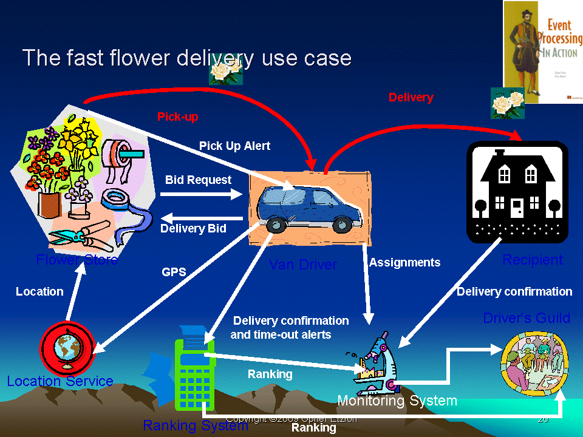
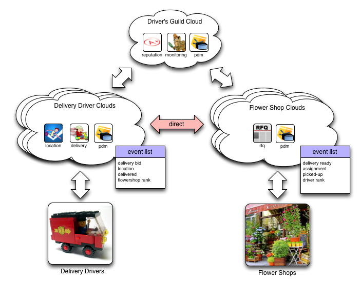
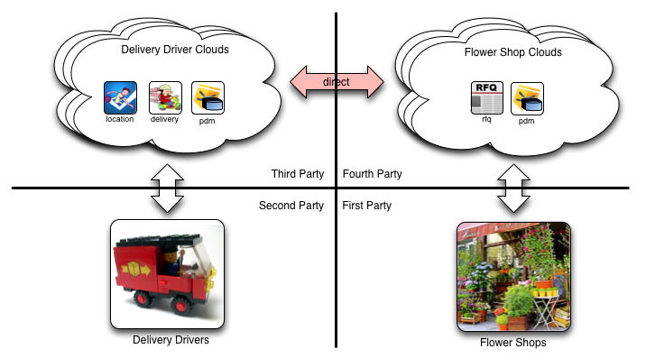
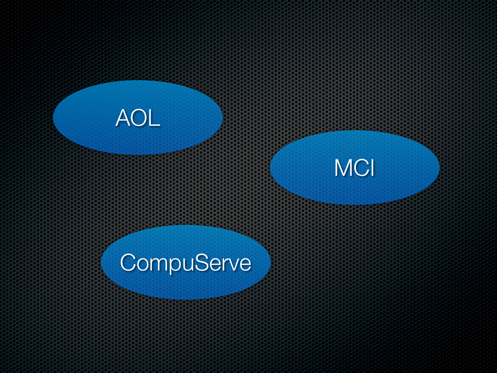
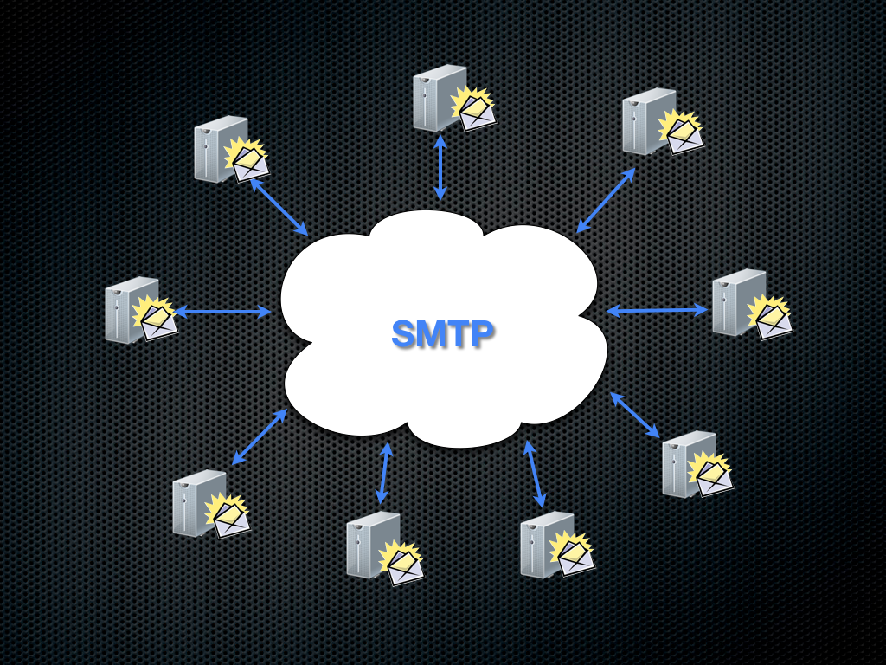

#Personal Event Networks: Building Personal Clouds
A book on personal clouds and the philosophy, use, and construction of personal event networks. 

This is the home of 'Personal Event Networks', an (in-progress) book. It is released under a [CC](http://creativecommons.org/licenses/by-nc-sa/3.0/)-license.

Corrections and suggestions are always welcome.

##Table of Contents

* ####[Introduction](#introduction)
	* The Second PC Revolution: Personal Clouds
	* Federating Personal Event Networks 
	* Deliver Flowers
	
* ####[Protocols and Metaprotocols](#protocols)

* ####[Resources](#resources)

* ####[About the Author](#author)

#<a name="introduction">Introduction</a>

Everyone wants leverage. Getting more done with less effort. Accomplishing what needs to be done easily and without hassle.

Suppose you had a personal assistant that took care of all the details for your travel, finding a doctor, managing your house? Enabling you to focus on what's important---even providing brand new opportunities that aren’t available to you today.

A personal event network isn't just a digital personal assistant. Your personal event network can hold dozens of apps that function as personal digital assistants for every aspect of your life. These apps connect products and services you use everyday and coordinate their interactions on your behalf.

Personal event networks will enable new kinds of commerce that is not only more efficient, but also more gratifying. The power of a personal event network is harmonizing your various lives: business, personal, and social. Having a personal valet that thinks about you---your needs, your quirks, your life. A personal event network puts you into a position of just making go—no go decisions, rather than having to get involved in all the gritty details of how they get done.

A real personal assistant is only for the realms of Kings, Presidents & CEOs. A personal event network provides that same luxury to the rest of us.

Do you want to be freed from the mundane so you can focus on what you need to get done? Do you want new levels of convenience and luxury? Then you want a personal event network.

## The Second PC Revolution: Personal Clouds

In 1976, I started at the University of Idaho. My advisor was Keith Prisbrey, a brand new Assistant Professor of Metallurgical Engineering. I count him as one of the great mentors of my life. Keith recognized something in me and took me under his wing---as a freshman. One day he said "Have you ever done anything with electronics?" I told him I'd made a few HeathKit radios in high school. He then said “I’ve got this MITS Altair computer we bought that needs to be built. Could you do that for me?” I knew about the Altair. I had devoured the magazine when it came out and dreamed about having one someday. Keith’s offer was a dream-come-true.

The Altair was a computer with a CPU, memory, serial cards, and so on. The Altair didn't have any kind of secondary storage. I used a teletype with a paper tape reader to load Bill Gates’ 4K Basic and then wrote programs in that. We rarely turned the computer off because booting it to a usable state took a long time and a lot of work.

Basic ran on the bare metal. There was no operating system. I wrote a monitor program on an HP2000, cross-compiled it to the 8080, and burnt it to PROM so that we had something when the Altair started besides just the front panel switches. The only way to store anything was to write it out to paper tape. Eventually we got a cassette tape storage device, but it was buggy and rarely worked.

The Altair and its contemporaries, including the Apple I, were largely toys. They were fun to play with, but rarely used for anything productive. We called them micro computers, not personal computers. Personal computers like the Apple II, the TRS-80, and others came along a few years later. This second generation was very different from the Altair and Apple I in several important ways including the following:

* they had disk drives (mostly floppies)
* they had operating systems

These changes made personal computers out of micro computers. As a result of these two changes, application software became possible. Dan Briklin and Bob Frankston created, published, and sold VisiCalc. Suddenly, I could run my programs on my data. This change was enormous. Suddenly I had a computer that worked for me. The modern smartphone is the ultimate expression of this idea: a computer that is just for me, runs my apps, keeps my data and connects me to the Internet---anywhere, anytime.

Fast forward to 2011. Cloud computing and big data are two of the most talked about topics at technology conferences. But I believe that these are the mainframe ideas of our time. Nothing wrong with that, but they are almost never discussed in terms of the personal. Lately, I've been talking a lot about personal event networks. A personal event network is a kind of personal cloud---one based on what I think of as little data or data about me.

Computers became personal when they combined my apps with my data. Clouds become personal in exactly the same way. This is different than just a Web app that has it's own data store. Data and apps must be separable. The combinatorial possibilities that emerge from being able to use data from one app in another is important. The value created for users and companies is greater when apps and data are separable.

Personal event networks are not the only examples of personal cloud technology. What Google is building amounts to a personal cloud. When I log in to Google, I have email, calendars, documents, a social network, and so on. Similarly, Facebook can be thought of as a personal cloud. There's even a way for me to run apps in the Facebook cloud. Google and Facebook are operating systems for managing data and apps in the cloud. The results are imperfect, as yet. For example, apps and data are too tightly coupled in both. But what they’re doing is suggestive of what could be.

Kynetx is building a personal cloud that is very different than the ones that Google, Facebook, and others envision. The Kynetx personal cloud is based on personal event networks. A personal event network is an application platform. It's personal because every person has their own event network where they control

* the apps
* the data
* the events

As an example, the use case in this video illustrates how those elements combine to create a much better travel experience:

*need to describe use case?*

This use case highlights the interplay between events, personal data, and applications that use both. Moreover, Phil saw significant value from this interaction:

* Setting an appointment created travel plans
* Car and room were personalized
* Less waiting in lines
* Expense report happened automatically
* Focus on his goal: selling the client

Imagine that be might have dozens of apps customizing, personalizing, and automating the workflow of his life. He is in charge of important choices, but freed from the mundane tasks. Not only his online services, but products he uses, participate as well.

Want a personal event network? Me too. So I'm building them. The good news is that most of it is ready now. What’s missing? An ecosystem of products and services that raises events for you. I want to fix that. I want to create an ecosystem of a dozen of so interesting products and services on which we can build a half dozen workflow automation applications that use permissioned personal data. That means I need two things: money and partners.

The first is fairly straightforward, although not easy. Kynetx is raising money to build real personal event networks. Contact me if you have thoughts about that.

When I say we need partners, what I mean specifically is that we need companies that will, at least on a pilot basis, event enable their products and services. This isn't particularly hard, but it does involve some convincing of these partners.

## Delivering Flowers

This semester, I'm teaching a class at BYU, CS462. We're using [Opher Etzion](http://epthinking.blogspot.com/) and Peter Niblett's book [Event Processing in Action](2) as the class text. The text uses a [flower shop and delivery driver scenario](http://www.ep-ts.com/content/view/80/111/) as the running example throughout the book. Here's a description: 

> The flower stores in a large city have established an agreement with local independent van drivers to deliver flowers from the city's flower stores to their destinations. When a store gets a flower delivery order, it creates a request, which is broadcasted to relevant drivers within a certain distance from the store, with the time for pick up (typically now) and the required delivery time if it is an urgent delivery. A driver is then assigned and the customer is notified that a delivery has been scheduled. The driver picks up the delivery and delivers it, and then person receiving the flowers confirms the delivery time by signing for it on the driver’s mobile device. The system maintains a ranking of each individual driver based on his or her ability to deliver flowers on time. Each store has a profile that can include a constraint on the ranking of its drivers, for example a store can require its driver to have a ranking greater than 10. the profile also indicates whether the store wants the system to assign drivers automatically, or whether it wants to receive several applications and then make its own choice. 

The following diagram (from the [Event Processing Technical Society's site](http://www.ep-ts.com/content/view/80/111/)) illustrates the interactions that take place between various entities: 

The example that Opher details in the book has been [implemented in several event processing systems](http://www.ep-ts.com/content/view/79/112/). 

Consequently, as we implement the flowershop example in my class, we're going to do it with a personal event network twist. The result looks something like this diagram: 

In the preceding diagram, there isn't one event system that manages the interactions between the shops and the drivers. Rather, each driver has their own personal event network, each shop has their own personal event network, and the guild has one too. The interactions aren’t simply events raised within a single event network, but rather events raised between the networks of each participant. I’ve shown some of the apps that drivers, shops, and the guilds have installed on their personal event networks, but they would each be individually managed and configured. In fact, it’s reasonable to assume that different drivers or shops might use different apps for the same purpose as long as they understood the events. 

The various personal event networks are linked together via *event subscription*. For example, a driver might subscribe to the `delivery_ready` event from each of the flowershops she wants to drive for. A driver who has a bad experience with a particular shop, merely unsubscribes from that shop's <tt>delivery_ready</tt> events and never sees them again. Similarly, a shop that doesn’t like a particular driver can merely unsubscribe from them and no longer do business with them. I'll be posting an example soon that shows how event subscription works in a personal event network. There are lots of details to work out and this blog post isn't the place for them. 

There are design choices to be made in this system. For example, there's a *direct* arrow in the diagram indicating that shop and driver personal event networks can communicate directly. But the guild may chose to intermediate the interactions. In class, we're going to be implementing the system with a direct connection first and then re-plumb the entire thing to use the guild as an intermediary. Intermediaries introduce interesting dynamics, making many things easier and increasing flexibility. 

Overall, this example isn't terribly different from the [fourth-party ecommerce](http://www.windley.com/archives/2011/06/anonymous_ecommerce_building_a_real_4th_party_offer_application_with_kynetx.shtml) example I wrote about last June except that example featured hardwired connections between the shopper and the merchant rulesets. In contrast, this example uses the idea of event subscription to link merchants and customers. Event subscription takes the fourth-party example from a nice little demonstration to a conception of how [VRM](http://cyber.law.harvard.edu/projectvrm/Main_Page) could work in the real-world. The diagram shown above can be partitioned to illustrate this: 

Together with our ideas about how notification occurs and how personal data can be managed in personal event networks, event subscription creates a powerful system for enabling a completely new kind of interaction between vendors and customers (note that in this example, the flowershop is the customer who is negotiating for and buying delivery services from the drivers).

## Federating Personal Event Networks 

#<a name="protocols">Protocols and Metaprotocols</a>

*need an intro here* 

## Ways, Not Places

Since the dawn of the World Wide Web, we've been fixated on the concept of "place." The entire language of the Web is about location: we *visit Web sites* using *Web addresses*. Consequently, it's almost impossible for us to think there's any other way. We build places where we expect people and machines (via APIs) to come, meet, and transact. 

Places are one way to organize an information system. The place metaphor leads to centralization. Facebook, Google, and Amazon are all places. The interactions on them are centralized and under the control of whoever owns the place. Place-thinking leads to what [Doc Searls decries as the "calf-cow" model](http://www.linuxjournal.com/content/way-ranch). 

Of course, places are the only way we can organize information systems. To see what I mean, let me borrow an example from [Drummond Reed](http://equalsdrummond.name/). Drummond starts by reminding us what email looked like for most people in 1992: 

AOL, MCI, CompuServe, Prodigy, and a few other large players provided *places* where people could send email. These were centralized systems and interoperability was scarce to non-existent. You were captive within the island of email exchange defined by your provider. 

But there was another way--literally *a way*--that some of us used email back in the day. We exchanged it using a protocol called [SMTP](http://en.wikipedia.org/wiki/SMTP). Protocols like SMTP define ways or methods for things to interact. They give the interaction a script, as it were, defining how an interaction plays out. "If you do X, then I'll do Y." "If you do X and then do Y, that's an error." and so on. Consequently, today email looks more like this: 

Are there big providers still? Sure. But they don't control email. I've moved my actual email service--without changing my email address--several times over the years. Right now I use GMail, but I could switch tomorrow if something better came along. 

To understand why *ways* are better than *places*, you need only contemplate where email might be today had we never made the jump to SMTP and still used islands of centralized email services. You might envision it looking something like instant messaging in 2012--yeah, non-existent. EMail's dominant position and power owe *everything to protocol*. 

Now, imagine something that we just assume has to look like a place: e-commerce. E-commerce in 2012 is firmly entrenched in place-thinking. Consequently, we end up with a Web that looks like a collection of interactive mail-order catalogs. This is something like what people envisioned for interactive TV in 1990: "you'll be able to buy anything by just clicking a button." 

What if there were a protocol for e-commerce? What might happen? Let me paint a picture. A few months ago, I had six spare gorilla racks that I needed to unload. I went to a place--KSL Classified--and created a listing. Then their system took over and handled the interactions in some private, known-only-to-the-developer method completely within their site. Anyone who wanted to see if there were Gorilla Racks for sale had to go to their site. `#FAIL` 

If there were a protocol for e-commerce, I could have merely listed the racks as unwanted in the inventory system on my personal cloud (stick with me here--protocols require different infrastructure than places). People looking for racks would broadcast their intent to purchase them. The protocol would connect anyone interested in buying storage racks to me and my cloud, allowing for much of the interaction to happen automatically. All in a distributed, decentralized manner. Where'd I get this cloud? From a cloud vendor who sells clouds that understand e-commerce, messaging, to-do, and other protocols, of course. 

If you expand on this idea, you'll see that an e-commerce protocol leads to all sorts of interesting interactions and outcomes that don't obtain in a world of centralized interactive catalogs. 

What's interesting is that the heritage of the Internet and the Web is one of protocols. Their legacy--at least to date--is one of places. The Web really isn't a Web at all. We've made links second class citizens and consequently built a system where largely stand-along sites site on the "information superhighway" with a few large directories driving people straight to the centralized place of their choice. There is a better way. One that leads to richer outcomes and more interesting futures. [Join me there](http://www.windley.com/archives/2012/03/journey_out_to_our_frontier.shtml).

 
## Protocols

The Internet is a creature born of protocol. Protocols are agreements among a set of parties on a sequence of operations and the format of messages that will be used to communicate for a given purpose. For example, [SMTP](http://en.wikipedia.org/wiki/Simple_Mail_Transfer_Protocol), Simple Mail Transport Protocol is the protocol that enables email servers to exchange email messages with one another. 

Distributed systems depend on protocols to function. In [*Protocol*]( http://mitpress.mit.edu/books/chapters/0262072475chap1.pdf) (PDF), Andrew Galloway says "protocols are the enemy of bureaucracy, of rigid hierarchy, and of centralization." Protocols enable ways to overpower and supplant places. 

Protocols have both syntactic and semantic elements. For example, there is a specific form or syntax that the SMTP protocol prescribes for indicating the recipient of the message. The fact that it indicates the message recipient is the semantics of that particular field. 

Internet protocols usually rely on other protocols. For example, actually *doing email* involves not just SMTP, defining how to exchange email messages, but also other protocols like DNS for name resolution, IMAP or POP for mailbox management, and MIME for specifying message content. Then there's the "envelop" protocol. For example, SMTP doesn't talk about transport, that's TCP/IP's job. TCP/IP is, for SMTP, and envelop protocol. 

Consider the hypothetical e-commerce protocol from above: 

>What if there were a protocol for e-commerce? What might happen? Let me paint a picture. A few months ago, I had six spare gorilla racks that I needed to unload. I went to a place, *[KSL Classifieds](http://www.ksl.com/?nid=47)*, and created a listing. Then their system took over and handled the interactions in some private, known-only-to-the-developer method completely within their site. Anyone who wanted to see if there were Gorilla Racks for sale had to go to their site. #FAIL 

>If there were a protocol for e-commerce, I could have merely listed the racks as unwanted in the inventory system on my personal cloud (stick with me here--protocols require different infrastructure than places). People looking for racks would broadcast their intent to purchase them. The protocol would connect anyone interested in buying storage racks to me and my cloud, allowing for much of the interaction to happen automatically. All in a distributed, decentralized manner. Where'd I get this cloud? From a cloud vendor who sells clouds that understand e-commerce, messaging, to-do, and other protocols, of course. 

This leads to some interesting questions like: "Where would such a protocol come from?", "How would it work?", and "How would it be adopted?" In this blog post, I'd like to paint a picture of how I see such a world unfolding. 

## Protocols and APIs

Some people are rather militant about properly distinguishing APIs from protocols. I've gotten comments from people that say things like "that's a protocol, not an API!" Lately it's become fashionable to call any thing with a REST interface an "API"--even when they're more properly protocols. I think some of this is simple confusion, but it's also an attempt to make things sound easier. No company wants programmers to think their system is hard to use and protocols sound hard. 

What's more, some Web APIs are pretty straightforward request-response systems where protocol sounds overly ambitious. For those interfaces, API is probably the right word. But other so-called APIs are really protocols. People have started to refer to these as "push" APIs. [Twilio](http://www.twilio.com)'s API, for example is a full blown protocol as it clearly defines an agreement on sequences of operations and formats for messages with the goal of accomplishing telephony tasks using the Twilio system. Modulo intellectual property issues, one could imagine another online PBX adopting the Twilio API as a standard. 

One of my goals is to get more Web APIs to send events--to become more properly protocols instead of mere request-response based APIs. My motivation is systems that are more loosely coupled and better able to act as peers in orchestrated Web interactions. [Sam Curren](http://www.mostlybaked.com) and I have developed the [Evented API](http://www.eventedapi.org/) specification to come up with a standard way of adding events to APIs, making them more properly protocols. 

## Metaprotocols

Programmers reverence protocols. We think of protocols as something given to us from on high by the Cerfs, Postels, and Berners-Lees of the world. But the truth is that programmers build protocols all the time. Sometimes these are *ad hoc* and other times they are built with the help of a metaprotocol. 

A metaprotocol is a protocol for building or describing other protocols. You're undoubtedly familiar with some metaprotocols even if you haven't thought of them that way before. SOAP, RMI, CORBA, and JSON are all examples of metaprotocols. We often use words like *framework*, *IDL*, *specification*, or even just *format* when we're talking about metaprotocols. The page from Caucho Technology on [metaprotocol taxonomy](http://hessian.caucho.com/doc/metaprotocol-taxonomy.xtp) does a pretty good job of classifying various metaprotocols. 

RMI, for example is a metaprotocol that defines the syntax of interactions between classes. RMI specifications are given by the Java class definition using reflection. Whenever someone uses RMI to specify the interactions between Java classes, they're defining a machine-readable protocol. 

The [Evented API specification]( http://www.eventedapi.org/) also defines a metaprotocol. Events are transported over HTTP and the specification defines a format (i.e. syntax) for how events can be encoded. 

Using the Evented API specification, however, requires that a developer further define the events that will be raised. By defining the event domain and type as well as the required and optional attributes for each event type, the developer creates a protocol for sending notifications. We'll see example of this below. 

## EXP, KRL, and Protocols

Moving beyond the general Evented API specification, we get to EXP and how it and the [Kinetic Rule Language](http://docs.kynetx.com/display/docs/Overview) (KRL) gives rise to personal event networks. KRL is designed to build systems that support EXP. 

EXP, currently defined by the [Sky Event specification](http://docs.kynetx.com/display/docs/Sky+Event+API), is a metaprotocol. We get a protocol by defining two things: 

1.  Certain variables in the event signal must be defined: notably, the event domain and type along with any event attributes. 
2.  The return value must be specified. The return value may be empty. Usually, the preferred form is a JSON data structure, but the system is flexible enough to return other types as well. 

You might think of these actions as *instantiating* the EXP metaprotocol to define specific protocol instance. 

Any given KRL ruleset responds to a specific instance of EXP, not EXP itself. Because of [the event expressions in `select` statements](http://docs.kynetx.com/display/docs/Event+Expressions), we can calculate the specific events to which a given ruleset responds. This is called *salience* data. This is similar to the way that RMI uses Java classes to determine the specification for the object method interactions to which a particular Java class will respond. Similarly, we can calculate the potential return results--the directives--that a given ruleset can return. 

Sometimes, events are raised by another ruleset, but often they are raised by what we refer to as "endpoints." An endpoint in the Kinetic Event Architecture is an event generator. This might be something as complicated as a browser extension or as simple as an Arduino making an HTTP POST. We've built browser extensions, mobile applications, email gateways, telephony gateways, IRC bots, and network proxies that function as endpoints. 

An endpoint or ruleset that raises events in a personal event network is wasting it's time and network bandwidth unless there is an installed ruleset that understands the event protocol that the endpoint uses. That is determined by the event expressions in each rule. Further, the endpoint must be written to understand the directives that any selected rules return. Thus rulesets define a protocol to which the endpoint must adhere. 

## Events in EXP are Personal

The [Sky event specification](http://docs.kynetx.com/display/docs/Sky+Event+API) requires that events be raised to a specific [event channel](http://www.windley.com/archives/2012/02/event_channels.shtml). Each event channel is associated with an entity--usually a person, but it could be anything that is uniquely identifiable. 

When events are raised on a specific channel, the associated entity is calculated along with a list of rulesets that the entity has installed. The salience data for the installed rulesets is used to determine which rules should be evaluated. 

Consequently, when any event is raised to the EXP service, the response depends on who the event is raised for and what rulesets they have chosen to install. EXP thus gives rise to personal event networks. 

## Why a Network?

I use the term *network* in describing personal event networks because the system I've described above gives rise to a network of event processors, the rulesets, under the control of an entity that raise events to each other as well as seeing events from endpoints (event generators) that the owner of the network has configured. (Note: only endpoints that have an event channel identifier can raise events into a personal event network.) 

We have further previously [shown](http://www.windley.com/archives/2012/03/sending_events_in_parallel.shtml) [ways](http://www.windley.com/archives/2012/02/on_call_ta_distributed_event_network_federation_through_subscription.shtml) that event networks can raise events to each other giving rise to federations of personal event networks. These federations animate interactions such as those that support flower deliveries or on-call teaching assistants. 

This does not imply that the EXP Service itself is networked. In fact, it needn't be. Any number of independent EXP Services could be set up, each servicing one or more entities. These services wouldn't necessarily know about each other, although the personal event networks operating on them might. You and I might federate rulesets in our personal event networks without caring whether our personal event networks were operating on the same or different instances of KRE. 

## Wither the E-commerce Protocol?

Finally, we're ready to talk about the hypothetical e-commerce protocol I mention at the first of this post. As you've probably surmised by now, EXP is *not an e-commerce protocol*. Rather an e-commerce protocol could be defined in EXP using it's powers as a metaprotocol. 

Right now, there's one, simple example of a event-based protocol defined in EXP, the [Notification Event Protocol](http://docs.kynetx.com/display/docs/Notification+Event+Protocol). This specification is far from finished, but it's been very helpful fleshing out the ideas in this post. I describe this protocol and the simple ruleset I built to process it in a blog post: [Notifications in Personal Event Networks](http://www.windley.com/archives/2011/12/notifications_in_a_personal_event_networks.shtml). Note that the notification specification does not, at present, specify any return value. 

The [flower delivery](http://www.windley.com/archives/2012/01/delivering_flowers_with_a_distributed_event_system_event_subscription_in_action.shtml) system students in my CS462 class are building defines a protocol for linking delivery drivers and vendors who need deliveries made. You can [see the details in the lab descriptions](https://github.com/windley/CS462-Event-Edition/tree/master/project) if you're interested. One interesting note: return results aren't used. Rather event networks communicate with each other strictly through events as described in the lab. 

Similarly, an e-commerce protocol would need to be defined in EXP. There might be multiple event domains, certainly many event types, and the attribute design would be critical. Return results might not be as important depending on how the interaction is meant to play out. 

How would such a protocol gain adoption? In the usual ways: by convention, by standardization, or both. Certainly Amazon has enough weight that if they started supporting an e-commerce protocol, the rest of the market would probably accept it as convention. Even better if they or someone like them lent their support to the design and standardization of such a thing. But large merchants may not see such a protocol as being in their best interest. For example, Ebay probably has little interest in seeing ways replace places.

## Data and Personal Clouds

Personal clouds need access to data. Lots of data. Data from all over. I envision my personal cloud as a general purpose computing platform that is always working for me. As such, it will need access to all sorts of data about me, my schedule, my to do list, and so on. Of course, it's not really the cloud that needs access to the data, but the programs running in it. 

Let's return once again to the e-commerce scenario we discuss above. 

>If there were a protocol for e-commerce, I could have merely listed the racks as unwanted in the inventory system on my personal cloud (stick with me here—protocols require different infrastructure than places). 

The scenario only lightly touches on the role of data by referencing some magical inventory system. What would it take to make an e-commerce protocol real?

*   First, I mention that there's some inventory of my stuff somewhere. This may seem farfetched at first, but why not? Amazon already gives me a list of all the books I've bought. Costco and REI know everything I've bought. Getting data about the things I buy and then having an automatically maintained *inventory of my stuff* probably isn't that far off. 
*   This scenario also would need to know how I accept payments. Paypal, Square and other services let me do that. Having that data available to the system wouldn't be hard. 
*   Personal data and contact information would also be needed as we moved toward consummating the sale. 

How would the EXP service supporting my personal cloud know about all this data and have access to it? How could a developer write applications that have access to my data and your data even though we might be using different underlying systems for keeping personal data? How will the service know that things like "buy" and "purchase" are the same concept? 

The answer to these questions is that we need a data abstraction layer. There are two important features that such an abstraction layer need: 

*   **location-independent references** - when a program needs access to the user's phone number, location-independent references abstract finding where that data is stored from the reference itself. So, for example, suppose you store your phone number in GMail contacts and I store mine at Personal.com. The application doesn't have to know that or how to connect to those various services. The program references a name that means "user's phone number" and the data abstraction layer takes care of the messy details.
*   **semantic data interchange** - when the program wants the user's phone number and one system stores it as "cell" and another as "mobile" how do we know that's the same thing? For one or two things, it's easy enough to create these mappings *ad hoc* but that quickly gets old. The data abstraction layer makes these translations automatically.

#<a name="resources">Resources</a>

#<a name="author">About the Author</a>
Phil Windley is the Founder and Chief Technology Officer of Kynetx. Kynetx provide a cloud-based application platform that is uniquely architected to use events, personal data, and APIs to create social products and services. He is also an Adjunct Professor of Computer Science at Brigham Young University where he teaches courses on reputation, digital identity, large-scale system design, and programming languages. Phil writes the popular Technometria blog and is a frequent contributor to various technical publications. He is also the author of the books The Live Web published by Course Technology in 2011 and Digital Identity published by O'Reilly Media in 2005.

Prior to joining BYU, Phil spent two years as the Chief Information Officer (CIO) for the State of Utah, serving on Governor Mike Leavitt's Cabinet and as a member of his Senior Staff. Before entering public service, Phil was Vice President for Product Development and Operations at Excite@Home. He was the Founder and Chief Technology Officer (CTO) of iMALL, Inc. an early creator of electronic commerce tools. Phil serves on the Boards of Directors and Advisory Boards for several high-tech companies. Phil received his Ph.D. in Computer Science from Univ. of California, Davis in 1990.
